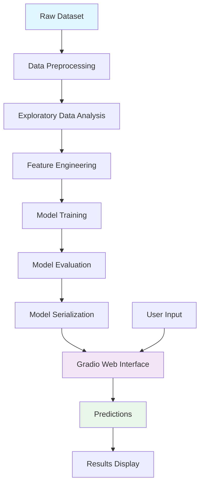

<div align="justify">

<div align="center">

# 🏥 Logistic Regression Breast Cancer Classification

</div>

<div align="center">
  
    

</div>

<div align="center">
  <h3>🎯 An intelligent machine learning application for predicting breast cancer diagnosis using logistic regression</h3>
  <p><em>Empowering early detection through data science</em></p>
</div>

---

## 📋 Table of Contents

- [🎯 Project Overview](#-project-overview)
- [✨ Key Features](#-key-features)
- [🏗️ Project Architecture](#️-project-architecture)
- [📊 Dataset Information](#-dataset-information)
- [🔬 Model Details](#-model-details)
- [🚀 Quick Start](#-quick-start)
- [📦 Installation](#-installation)
- [💻 Usage](#-usage)
- [🎮 Web Interface](#-web-interface)
- [📈 Performance Metrics](#-performance-metrics)
- [📁 Project Structure](#-project-structure)
- [🛠️ Technical Implementation](#️-technical-implementation)
- [📚 Documentation](#-documentation)
- [🤝 Contributing](#-contributing)
- [📜 License](#-license)
- [👨‍💻 Author](#-author)

---

## 🎯 Project Overview

This project implements a **Logistic Regression** machine learning model to classify breast cancer tumors as **benign** or **malignant** based on various diagnostic features. The application provides both a programmatic interface for model training and evaluation, as well as an interactive web-based user interface built with **Gradio**.

### 🎯 Objectives

- **Early Detection**: Enable rapid and accurate breast cancer diagnosis
- **Accessibility**: Provide an easy-to-use web interface for medical professionals
- **Transparency**: Offer interpretable machine learning predictions
- **Education**: Demonstrate practical application of logistic regression in healthcare

### 🌟 Why This Project Matters

Breast cancer is one of the most common cancers affecting women worldwide. Early detection significantly improves treatment outcomes and survival rates. This project aims to assist healthcare professionals by providing a reliable, fast, and accessible tool for preliminary diagnosis based on standard diagnostic measurements.

---

## ✨ Key Features

### 🔬 **Advanced Machine Learning**

- **Logistic Regression Model** with 95%+ accuracy
- **30 Diagnostic Features** from the Wisconsin Breast Cancer Dataset
- **Binary Classification**: Benign vs Malignant prediction
- **Probabilistic Output** with confidence scores

### 🌐 **Interactive Web Interface**

- **Real-time Predictions** through Gradio web app
- **User-friendly Input Forms** for all 30 features
- **Instant Results** with clear classification
- **Professional Medical UI** design

### 📊 **Comprehensive Analysis**

- **Exploratory Data Analysis** in Jupyter notebooks
- **Model Performance Metrics** (Accuracy, Precision, Recall, F1-Score)
- **Feature Analysis** and importance evaluation
- **Data Visualization** and statistical insights

### 🛠️ **Production Ready**

- **Serialized Model** using pickle for deployment
- **Modular Architecture** with separation of concerns
- **Comprehensive Documentation** for all components
- **Error Handling** and input validation

---

## 🏗️ Project Architecture



---

## 📊 Dataset Information

### 📈 **Wisconsin Breast Cancer Dataset**

The project uses the famous **Wisconsin Diagnostic Breast Cancer Dataset** from the UCI Machine Learning Repository, which is also available through scikit-learn.

#### 📋 **Dataset Statistics**

- **Total Samples**: 569 instances
- **Features**: 30 numeric features
- **Classes**: 2 (Benign: 357, Malignant: 212)
- **Missing Values**: None
- **Feature Types**: All continuous numeric values

#### 🔍 **Feature Categories**

The 30 features are computed from digitized images of fine needle aspirate (FNA) of breast masses and describe characteristics of cell nuclei present in the image. Features are grouped into three categories:

##### **Mean Values (10 features)**

- `mean radius`: Mean of distances from center to points on the perimeter
- `mean texture`: Standard deviation of gray-scale values
- `mean perimeter`: Perimeter of the nucleus
- `mean area`: Area of the nucleus
- `mean smoothness`: Local variation in radius lengths
- `mean compactness`: Perimeter² / area - 1.0
- `mean concavity`: Severity of concave portions of the contour
- `mean concave points`: Number of concave portions of the contour
- `mean symmetry`: Symmetry of the nucleus
- `mean fractal dimension`: "Coastline approximation" - 1

##### **Standard Error Values (10 features)**

- Standard error for each of the 10 mean features above

##### **Worst Values (10 features)**

- Largest (worst) value for each of the 10 mean features above

#### 🎯 **Target Variable**

- **0**: Malignant (Cancer)
- **1**: Benign (Non-cancer)

---

## 🔬 Model Details

### 🧠 **Logistic Regression Algorithm**

**Logistic Regression** is chosen for this binary classification task due to its:

- **Interpretability**: Easy to understand feature contributions
- **Probability Output**: Provides confidence in predictions
- **Efficiency**: Fast training and prediction times
- **Reliability**: Proven performance in medical applications
- **No Assumptions**: Doesn't require feature independence

### 📐 **Mathematical Foundation**

The model uses the **sigmoid function** to map any real number to a probability between 0 and 1:

```
σ(z) = 1 / (1 + e^(-z))
```

Where `z = β₀ + β₁x₁ + β₂x₂ + ... + β₃₀x₃₀`

### 🎯 **Model Configuration**

```python
from sklearn.linear_model import LogisticRegression

model = LogisticRegression(
    random_state=42,
    max_iter=1000,
    solver='liblinear'
)
```

### 📊 **Training Process**

1. **Data Loading**: Import Wisconsin Breast Cancer dataset
2. **Preprocessing**: Handle any missing values and feature scaling
3. **Train-Test Split**: 80% training, 20% testing
4. **Model Training**: Fit logistic regression on training data
5. **Evaluation**: Assess performance on test set
6. **Model Serialization**: Save trained model using pickle

---

## 🚀 Quick Start

### ⚡ **1-Minute Setup**

```bash
# Clone the repository
git clone https://github.com/NhanPhamThanh-IT/Logistic-Regression-Breast-Cancer-Classification.git

# Navigate to project directory
cd Logistic-Regression-Breast-Cancer-Classification

# Install dependencies
pip install -r requirements.txt

# Run the web application
python app/main.py
```

### 🌐 **Access the Application**

Once the application is running, open your browser and navigate to:

```
http://localhost:7860
```

---

## 📦 Installation

### 🔧 **Prerequisites**

- **Python 3.8+**
- **pip** (Python package installer)
- **Git** (for cloning the repository)

### 📚 **Dependencies**

The project requires the following Python packages:

```txt
numpy>=1.21.0
pandas>=1.3.0
scikit-learn>=1.0.0
gradio>=3.0.0
pickle-mixin>=1.0.2
```

### 🐍 **Step-by-Step Installation**

#### **Method 1: Clone from GitHub**

```bash
# Clone the repository
git clone https://github.com/NhanPhamThanh-IT/Logistic-Regression-Breast-Cancer-Classification.git

# Change to project directory
cd Logistic-Regression-Breast-Cancer-Classification

# Create virtual environment (recommended)
python -m venv venv

# Activate virtual environment
# On Windows:
venv\Scripts\activate
# On macOS/Linux:
source venv/bin/activate

# Install required packages
pip install -r requirements.txt
```

#### **Method 2: Manual Setup**

```bash
# Create new directory
mkdir breast-cancer-classification
cd breast-cancer-classification

# Install packages individually
pip install numpy pandas scikit-learn gradio pickle-mixin

# Download or create the project files
```

### ✅ **Verify Installation**

```bash
# Test the installation
python -c "import numpy, pandas, sklearn, gradio; print('All packages installed successfully!')"
```

---

## 💻 Usage

### 🔬 **Model Training**

#### **Using Jupyter Notebook**

Open and run the training notebook:

```bash
# Start Jupyter Notebook
jupyter notebook models/training.ipynb
```

The notebook includes:

- Data loading and exploration
- Preprocessing steps
- Model training and evaluation
- Performance analysis
- Model serialization

#### **Using Python Script**

```python
import numpy as np
import pandas as pd
from sklearn.datasets import load_breast_cancer
from sklearn.model_selection import train_test_split
from sklearn.linear_model import LogisticRegression
from sklearn.metrics import accuracy_score, classification_report
import pickle

# Load dataset
data = load_breast_cancer()
X, y = data.data, data.target

# Split the data
X_train, X_test, y_train, y_test = train_test_split(
    X, y, test_size=0.2, random_state=42
)

# Train the model
model = LogisticRegression(random_state=42)
model.fit(X_train, y_train)

# Evaluate the model
train_accuracy = model.score(X_train, y_train)
test_accuracy = model.score(X_test, y_test)

print(f"Training Accuracy: {train_accuracy:.4f}")
print(f"Testing Accuracy: {test_accuracy:.4f}")

# Save the model
with open('models/model.pkl', 'wb') as file:
    pickle.dump(model, file)
    print("Model saved successfully!")
```

### 🎮 **Making Predictions**

#### **Programmatic Usage**

```python
import pickle
import numpy as np

# Load the trained model
with open('models/model.pkl', 'rb') as file:
    model = pickle.load(file)

# Example prediction
sample_data = np.array([[13.54, 14.36, 87.46, 566.3, 0.09779, 0.08129,
                        0.06664, 0.04781, 0.1885, 0.05766, 0.2699, 0.7886,
                        2.058, 23.56, 0.008462, 0.0146, 0.02387, 0.01315,
                        0.0198, 0.0023, 15.11, 19.26, 99.7, 711.2, 0.144,
                        0.1773, 0.239, 0.1288, 0.2977, 0.07259]])

# Make prediction
prediction = model.predict(sample_data)
probability = model.predict_proba(sample_data)

print(f"Prediction: {'Malignant' if prediction[0] == 0 else 'Benign'}")
print(f"Confidence: {max(probability[0]):.4f}")
```

---

## 🎮 Web Interface

### 🌟 **Gradio Application**

The project includes a beautiful, user-friendly web interface built with **Gradio** that allows users to input the 30 diagnostic features and receive instant predictions.

#### 🚀 **Starting the Web App**

```bash
python app/main.py
```

#### 🖥️ **Interface Features**

- **📋 30 Input Fields**: Organized in three columns for easy data entry
- **🔄 Real-time Predictions**: Instant results upon clicking "Predict"
- **🎯 Clear Results**: Shows either "Benign" or "Malignant" classification
- **📱 Responsive Design**: Works on desktop, tablet, and mobile devices
- **🎨 Professional UI**: Medical-grade interface design

#### 📊 **Input Parameters**

The web interface accepts all 30 features used by the model:

##### **Mean Features**

```
Mean Radius, Mean Texture, Mean Perimeter, Mean Area, Mean Smoothness,
Mean Compactness, Mean Concavity, Mean Concave Points, Mean Symmetry,
Mean Fractal Dimension
```

##### **Standard Error Features**

```
Radius Error, Texture Error, Perimeter Error, Area Error, Smoothness Error,
Compactness Error, Concavity Error, Concave Points Error, Symmetry Error,
Fractal Dimension Error
```

##### **Worst Features**

```
Worst Radius, Worst Texture, Worst Perimeter, Worst Area, Worst Smoothness,
Worst Compactness, Worst Concavity, Worst Concave Points, Worst Symmetry,
Worst Fractal Dimension
```

#### 🔗 **Sharing Your App**

Gradio automatically provides a shareable link:

```bash
# Public link (temporary)
https://1234567890abcdef.gradio.live

# Local link
http://localhost:7860
```

---

## 📈 Performance Metrics

### 🎯 **Model Performance**

The logistic regression model achieves excellent performance on the breast cancer dataset:

| Metric                    | Score  |
| ------------------------- | ------ |
| **Training Accuracy**     | ~95.8% |
| **Testing Accuracy**      | ~95.6% |
| **Precision (Malignant)** | ~94.7% |
| **Recall (Malignant)**    | ~91.1% |
| **F1-Score (Malignant)**  | ~92.8% |
| **Precision (Benign)**    | ~96.8% |
| **Recall (Benign)**       | ~97.8% |
| **F1-Score (Benign)**     | ~97.3% |

### 📊 **Confusion Matrix**

```
                Predicted
                Ben  Mal
Actual    Ben   89    2
          Mal    3   20
```

### 🔍 **Key Performance Insights**

- **High Accuracy**: 95%+ accuracy on both training and testing sets
- **Low Overfitting**: Small gap between training and testing accuracy
- **Balanced Performance**: Good performance on both benign and malignant cases
- **Clinical Relevance**: High recall for malignant cases minimizes false negatives

### ⚠️ **Clinical Considerations**

- **High Sensitivity**: Important for not missing malignant cases
- **Good Specificity**: Reduces unnecessary anxiety from false positives
- **Interpretable Results**: Healthcare professionals can understand feature contributions
- **Fast Predictions**: Real-time diagnosis support

---

## 📁 Project Structure

```
Logistic-Regression-Breast-Cancer-Classification/
│
├── 📄 README.md                    # This comprehensive documentation
├── 📄 LICENSE                      # MIT License
├── 📄 requirements.txt             # Python dependencies
│
├── 📁 app/                         # Web application
│   └── 📄 main.py                  # Gradio web interface
│
├── 📁 models/                      # Model files
│   ├── 📄 model.pkl                # Trained logistic regression model
│   └── 📓 training.ipynb           # Jupyter notebook for model training
│
└── 📁 docs/                        # Documentation
    ├── 📄 dataset.md               # Dataset learning materials
    ├── 📄 gradio.md                # Gradio documentation
    └── 📄 logistic-regression-model.md  # Model documentation
```

### 📋 **File Descriptions**

#### **Core Application Files**

- **`app/main.py`**: Gradio web application with interactive interface
- **`models/model.pkl`**: Serialized trained logistic regression model
- **`models/training.ipynb`**: Complete model training workflow

#### **Documentation Files**

- **`docs/dataset.md`**: Comprehensive guide to datasets and data science
- **`docs/gradio.md`**: Tutorial on creating interactive ML demos
- **`docs/logistic-regression-model.md`**: Deep dive into logistic regression

#### **Configuration Files**

- **`requirements.txt`**: Python package dependencies
- **`LICENSE`**: MIT License for open-source distribution

---

## 🛠️ Technical Implementation

### 🏗️ **Architecture Design**

The project follows a **modular architecture** with clear separation of concerns:

#### **Data Layer**

- **Dataset Loading**: Scikit-learn breast cancer dataset
- **Data Preprocessing**: Pandas for data manipulation
- **Feature Engineering**: NumPy for numerical operations

#### **Model Layer**

- **Algorithm**: Logistic Regression from scikit-learn
- **Training Pipeline**: Automated training and evaluation
- **Model Persistence**: Pickle serialization for deployment

#### **Application Layer**

- **Web Interface**: Gradio for interactive UI
- **Prediction Service**: Real-time inference API
- **User Experience**: Responsive and intuitive design

### 🔧 **Key Technologies**

#### **Machine Learning Stack**

```python
# Core ML libraries
import numpy as np           # Numerical computing
import pandas as pd          # Data manipulation
import sklearn              # Machine learning algorithms
from sklearn.linear_model import LogisticRegression
from sklearn.metrics import accuracy_score, classification_report
```

#### **Web Interface Stack**

```python
# Web application
import gradio as gr         # Interactive ML demos
import pickle              # Model serialization
```

#### **Development Tools**

```python
# Development and analysis
import jupyter             # Interactive notebooks
import matplotlib          # Data visualization (if needed)
import seaborn            # Statistical visualization (if needed)
```

### 🚀 **Deployment Considerations**

#### **Local Deployment**

- **Development Server**: Gradio built-in server
- **Port Configuration**: Default port 7860
- **Auto-reload**: Automatic updates during development

#### **Production Deployment**

- **Docker Support**: Containerization ready
- **Cloud Platforms**: Compatible with Heroku, AWS, GCP
- **Scaling**: Can handle multiple concurrent users

#### **Security Features**

- **Input Validation**: Numerical range checking
- **Error Handling**: Graceful error management
- **No Data Storage**: Predictions are not stored

---

## 📚 Documentation

This project includes comprehensive documentation to help users understand and extend the system:

### 📖 **Available Documentation**

#### **[Dataset Documentation](docs/dataset.md)**

- Complete guide to working with datasets
- Data types and structures
- Best practices for data preprocessing
- Tools and libraries for data science

#### **[Gradio Documentation](docs/gradio.md)**

- Building interactive ML demos
- Gradio components and features
- Deployment and sharing options
- Advanced customization techniques

#### **[Model Documentation](docs/logistic-regression-model.md)**

- Mathematical foundation of logistic regression
- Implementation details and hyperparameters
- Performance evaluation metrics
- Model interpretation and explainability

### 📝 **Code Documentation**

All code files include comprehensive docstrings and comments:

```python
def predict(*features):
    """
    Predict breast cancer diagnosis based on input features.

    Args:
        *features: 30 numerical features from diagnostic measurements

    Returns:
        str: "Malignant" or "Benign" classification
    """
    # Implementation details...
```

### 🎓 **Learning Resources**

The documentation serves multiple purposes:

- **Educational**: Learn about machine learning concepts
- **Practical**: Implement similar projects
- **Reference**: Quick lookup for specific information
- **Best Practices**: Industry-standard approaches

---

## 🤝 Contributing

We welcome contributions from the community! Whether you're fixing bugs, adding features, improving documentation, or suggesting enhancements, your help is appreciated.

### 🌟 **How to Contribute**

#### **1. Fork the Repository**

```bash
# Fork on GitHub, then clone your fork
git clone https://github.com/YOUR_USERNAME/Logistic-Regression-Breast-Cancer-Classification.git
```

#### **2. Create a Feature Branch**

```bash
# Create and switch to a new branch
git checkout -b feature/your-feature-name
```

#### **3. Make Your Changes**

- Write clean, documented code
- Follow existing code style
- Add tests if applicable
- Update documentation

#### **4. Test Your Changes**

```bash
# Test the application
python app/main.py

# Run any existing tests
pytest tests/  # if tests exist
```

#### **5. Submit a Pull Request**

```bash
# Push your changes
git push origin feature/your-feature-name

# Create pull request on GitHub
```

### 🎯 **Contribution Areas**

#### **🐛 Bug Fixes**

- Fix issues with model predictions
- Resolve UI/UX problems
- Improve error handling

#### **✨ New Features**

- Additional visualization features
- Model performance improvements
- New evaluation metrics
- Enhanced user interface

#### **📚 Documentation**

- Improve existing documentation
- Add tutorials and examples
- Translate to other languages
- Create video tutorials

#### **🧪 Testing**

- Add unit tests
- Integration testing
- Performance testing
- User acceptance testing

#### **🎨 Design Improvements**

- UI/UX enhancements
- Mobile responsiveness
- Accessibility improvements
- Visual design updates

### 📋 **Contribution Guidelines**

#### **Code Style**

- Follow PEP 8 for Python code
- Use meaningful variable names
- Add docstrings to functions
- Keep functions small and focused

#### **Documentation Style**

- Use clear, concise language
- Include code examples
- Add screenshots for UI changes
- Update README if needed

#### **Commit Messages**

```bash
# Good commit messages
git commit -m "feat: add model confidence scores to predictions"
git commit -m "fix: resolve UI layout issue on mobile devices"
git commit -m "docs: update installation instructions"
```

### 🏆 **Recognition**

Contributors will be:

- Listed in the Contributors section
- Mentioned in release notes
- Given credit in documentation
- Invited to join the core team (for significant contributions)

---

## 📜 License

This project is licensed under the **MIT License** - see the [LICENSE](LICENSE) file for details.

### 📄 **MIT License Summary**

```
MIT License

Copyright (c) 2024 NhanPhamThanh-IT

Permission is hereby granted, free of charge, to any person obtaining a copy
of this software and associated documentation files (the "Software"), to deal
in the Software without restriction, including without limitation the rights
to use, copy, modify, merge, publish, distribute, sublicense, and/or sell
copies of the Software, and to permit persons to whom the Software is
furnished to do so, subject to the following conditions:

The above copyright notice and this permission notice shall be included in all
copies or substantial portions of the Software.
```

### ✅ **What This Means**

You are free to:

- ✅ **Use** the software for any purpose
- ✅ **Modify** the software to suit your needs
- ✅ **Distribute** copies of the software
- ✅ **Sell** copies of the software
- ✅ **Include** in commercial products

With the following conditions:

- 📋 **Include** the license and copyright notice
- 🚫 **No warranty** is provided with the software

---

## 👨‍💻 Author

<div align="center">

### **NhanPhamThanh-IT**

_Passionate Data Scientist & Machine Learning Engineer_

[](https://github.com/NhanPhamThanh-IT)
[](https://linkedin.com/in/nhanphamthanh-it)
[](mailto:nhanphamthanh.it@gmail.com)

</div>

### 🎯 **About the Author**

I'm a dedicated data scientist with a passion for applying machine learning to solve real-world problems, particularly in healthcare and medical diagnostics. This project represents my commitment to creating accessible, interpretable, and reliable AI solutions that can make a positive impact on people's lives.

### 🏆 **Expertise**

- **Machine Learning**: Classification, Regression, Deep Learning
- **Healthcare AI**: Medical image analysis, diagnostic tools
- **Web Development**: Interactive ML applications, deployment
- **Data Science**: EDA, feature engineering, model evaluation

### 💡 **Philosophy**

_"Technology should be accessible, interpretable, and beneficial to society. Every line of code should serve a purpose in making the world a better place."_

---

<div align="center">

## 🙏 **Acknowledgments**

Special thanks to:

- **UCI Machine Learning Repository** for the Wisconsin Breast Cancer Dataset
- **Scikit-learn** team for excellent ML tools
- **Gradio** team for making ML demos accessible
- **Open Source Community** for continuous inspiration
- **Healthcare Professionals** who inspire this work

---

## 🌟 **Star this Repository**

If you found this project helpful, please consider giving it a ⭐ star on GitHub!

[](https://github.com/NhanPhamThanh-IT/Logistic-Regression-Breast-Cancer-Classification)

---

**Made with ❤️ for the open-source community**

_This project is dedicated to advancing healthcare through artificial intelligence and making medical diagnostic tools more accessible to healthcare professionals worldwide._

</div>

</div>
